# Loom — Progress Check Report

**AI Matching Engine for Women's Livelihood Networks**
*Turning skills into income no one could reach alone*

| | |
|---|---|
| **Project** | Loom — a two-sided skills marketplace and team-assembly engine for women's Self-Help Group (SHG) networks in Kerala |
| **Team members** | Nidhi Rakesh · Niveditha G. S. · Anjana Nandakumar |
| **Institution** | Indian Institute of Information Technology (IIIT) Kottayam |
| **Hackathon / Track** | Girlathon — GDG On Campus, Mar Athanasius College of Engineering · *BharatNext: Building for Tier-2 and Tier-3 India* |
| **Period covered** | 13 July 2026 – 15 August 2026 |
| **Live deployment** | https://loom-lovat-phi.vercel.app — **working, publicly reachable, no install required** |
| **Repository** | https://github.com/nidheerakesh/loom |
| **Report status** | Reflects the code at commit `a0da02f`; all claims re-verified against the live deployment on 15 Aug 2026 |

> **Everything described below is deployed and running.** Where the build diverges from the
> original design specs (`docs/PRD.md`, `docs/TDD.md`), this report follows the build. §11 states
> what is *not* built, plainly.
>
> **No real users.** Loom has not been used by a self-help group, by Kudumbashree, or by any
> woman outside this team. Every provider, customer, group and order in the screenshots and
> results below is **seeded demo data with invented names**, created by `npm run seed`. Where
> this report says a team was assembled across "SHGs", it means seeded group records in our own
> database. The software works; it has not yet met a user. §11 records that as the gap it is.

---

## 1 · What we set out to build, and what exists today

**The problem.** India has 8.5 M+ women's self-help groups; ~4.5 M women are in Kerala's
Kudumbashree network alone. Credit and organisation have reached them at scale — *market access
has not*. Two failures follow: a woman cannot see paid demand three kilometres away, and the
largest opportunities (a 200-piece uniform order, a 300-plate catering job) are invisible to
everyone because **no single woman can fulfil them alone**.

**What we built.** Providers — an individual woman, or a small SHG-run unit — list skills.
Customers browse, filter and post work. Small jobs route to one person. Large or multi-skill
orders trigger a **capacity-aware team assembly across different SHGs**, and every result is
explained in Malayalam and can be spoken aloud.

Two decisions shaped the entire build:

- **Malayalam-first.** The app opens in Malayalam and remembers the choice. A user typing
  `sewing`, `tailoring`, `thayyal` or `തയ്യൽ` must land on the **same canonical skill**, or the
  marketplace fragments into unsearchable synonyms and the whole thing quietly fails.
- **Deterministic matching.** Ranking and team assembly are explainable, reproducible functions,
  not a black box. The same data always produces the same team — down to explicit tiebreak
  columns. Every match is written to an audit table before any sentence is generated, so the
  explanation *reports* the decision and cannot contradict it.

---

## 2 · Progress summary

| # | Milestone | Status | Evidence |
|---|---|---|---|
| 1 | Planning docs — PRD, TDD, user flows, UI/UX spec | Complete | `docs/` (5 documents, ~65 KB) |
| 2 | Data model — 24 tables, deterministic tiebreak columns | Complete | `app/supabase/schema.sql` |
| 3 | Backend — 42 API routes over 11 feature areas | Complete | `app/api/_routes/index.ts` |
| 4 | Frontend — 12 screens across provider + customer apps | Complete | `app/src/features/` |
| 5 | Skill canonicalisation (alias table + typo tier + translation) | Complete | `api/_routes/skills/resolve.ts` |
| 6 | Deterministic individual matching | Complete | `api/_lib/scoring.ts` |
| 7 | Collective matching — cross-SHG team assembly | Complete | `api/_routes/team-assembly/` |
| 8 | Phone + OTP authentication (no passwords) | Complete | `api/_routes/auth/` |
| 9 | Deployed publicly, continuously from `main` | Complete | Vercel `bom1` + Supabase |
| 10 | Realistic demo data | Complete | 40 providers, 6 customers, 5 requests |
| 11 | Chat privacy — 4 vulnerabilities closed | Complete, verified live | `003`/`005` migrations, runbook F1 |
| 12 | Text-to-speech, Malayalam + English | Complete | `src/lib/speech.ts` |
| 13 | Performance — N+1 elimination, region move | Complete | 21.0 s → 1.35 s measured |
| 14 | Row-level security on **every** table | Complete | `005_enable_rls_everywhere.sql` |
| 15 | Customer control — choose, edit, swap, confirm, complete | Complete | `requests/`, `team-assembly/` |
| 16 | Team chat + provider completion notice | Complete | commit `a0da02f` |
| 17 | Full demo runbook executed against production | 6/6 sections pass | `docs/DEMO_RUNBOOK.md` |
| 18 | Automated end-to-end suite against production | 78/78 checks pass | `app/scripts/e2e.mjs` |
| 19 | Speech-to-text, graph visualisation, admin surface | Not started | see §11 |

**Scale of the build**

| Measure | Count |
|---|---|
| Commits over the period | 34 |
| TypeScript / TSX written | ~7,200 lines (4,002 API · 3,214 frontend) + 589 lines of seed/dev tooling |
| API route handlers | 42, across 11 feature areas |
| Shared server modules | 13 (`api/_lib/`) |
| React screens | 12 user-facing, in two role-scoped apps |
| Postgres tables | 24, RLS enabled on all of them |
| Applied / written migrations | 5 |
| Design + process documents | 6 (`PRD`, `TDD`, `USER_FLOWS`, `UI_UX_DESIGN`, `SUBMISSION`, `DEMO_RUNBOOK`) |

---

## 3 · Timeline — how the month actually went

| Week | Dates | What happened |
|---|---|---|
| 1 | 13 – 26 Jul | Problem research and the four planning documents. First working app built on Convex + React. |
| 2 | 2 Aug | **Full backend migration off Convex** onto Supabase + Vercel Serverless. Every backend function rewritten. Then three deployment faults, each of which reported success (§6.2). |
| 3 | 2 – 7 Aug | Real demo data; phone + OTP sign-in; chat privacy audit and fixes; **N+1 elimination — the main screen went from 21 s to 1.35 s**; Malayalam defaults and self-hosted font; text-to-speech made real; "My work" view. |
| 4 | 8 – 9 Aug | Customer control (choose provider, edit request, swap team member); skill matching rewritten to match by **meaning** rather than letter-shape; RLS on every table; six silent database writes fixed; team chat; **full 15-minute runbook run against production, 6/6 sections pass**. |
| 5 | 15 Aug | **Automated end-to-end suite written and run against production — 78 checks, 0 failures**, driving five real accounts through both lifecycles, chat privacy and authorisation (§9.1). |

This month: roughly one week designing, one week rebuilding the foundation,
and two weeks hardening — security, performance, language, and the failure modes that look fine
from the outside. Most of the hardest work is invisible in a screenshot, so §6 records it.

---

## 4 · Tools, technologies and components

| Layer | Choice | Version | Why this one |
|---|---|---|---|
| Language | TypeScript | 5.2 | One language for matching engine *and* interface; strict mode everywhere |
| Frontend | React + Vite | 18.3 / 5.3 | Fast builds, simple SPA, small bundle |
| Styling | Tailwind CSS | 3.4 | Custom Kerala-handloom palette, 56 px touch targets enforced in one place |
| UI primitives | Radix UI + shadcn patterns | 1.x | Accessible dialogs, toggles, menus without shipping a heavy kit |
| Server state | TanStack Query | 5.59 | Caching and 7-second polling for chat and invitations |
| Backend | Vercel Serverless Functions | `@vercel/node` 3.2 | Same-origin `/api/*` — no CORS, no separate server to operate |
| Database | Supabase (PostgreSQL) | managed | Relational model of the livelihood network + RLS |
| Validation | Zod | 3.23 | A request schema at **every** route boundary |
| Auth | Phone + OTP, HMAC-signed tickets | — | No passwords; Twilio Verify optional, falls back to on-screen code |
| Voice output | Web Speech API (`ml-IN` / `en-IN`) | browser | Spoken Malayalam with no API key and no per-use cost |
| Translation | Bhashini NMT → NVIDIA → Anthropic → Gemini → offline echo | — | Only used to *name* a genuinely new skill; never influences a match |
| Deployment | Vercel (Mumbai `bom1`) + Supabase | — | Co-located with the users it serves |
| Runtime | Node | 22.x | — |

**Color palette**, defined once in `tailwind.config.js`:
`cotton #F3EFE6` · `indigo #26364F` · `kasavu #C9A227` · `madder #9C3B36` · `leaf #5B7A5B`.

**Typography.** Noto Sans Malayalam, self-hosted as a subset (~89 KB) rather than CDN-linked,
because the app targets patchy rural connections.

---

## 5 · System architecture

```
                Browser — React + Vite, Malayalam-first
                          │
                          │  same-origin  /api/*      (no Supabase client in the browser)
                          ▼
            api/router.ts          ← the ONE serverless function
                          │        path → handler map
                          ▼
            api/_routes/**         ← 42 handlers over 11 feature areas:
                          │          auth · providers · customers · skills · requests ·
                          │          matching · team-assembly · narration · ratings ·
                          │          grievances · chat
                          ▼
            api/_lib/**            ← supabaseAdmin · auth · scoring · geo · text
                          │          canonicalisation · chat access control ·
                          │          translation chain · SMS
                          ▼
            Supabase Postgres      ← 24 tables, RLS enabled on every one
```

**The browser talks only to `/api/*`.** No Supabase client ships to the frontend, so the database
is never addressed directly by an untrusted caller — this is both a security property (§7) and
the reason the bundle halved (438 KB → 221 KB).

**Data model.** `providers`, `customers`, `skills`, `groups`, `cds`, `requests` as entities, with
`provider_skills`, `request_skills`, `skill_aliases`, `near_distances`, `teams`, `team_members`,
`matches`, `chat_threads`, `messages`, `ratings`, `sessions`, `otps` and others as the typed
relationships and audit trail between them.

### 5.1 Design models

These were drawn before the build, and are reproduced as drawn. Read them as the design we set
out with, not as documentation of the deployed system — the two differ, and the differences are
tabulated below rather than quietly corrected in the diagrams.

**Use cases**

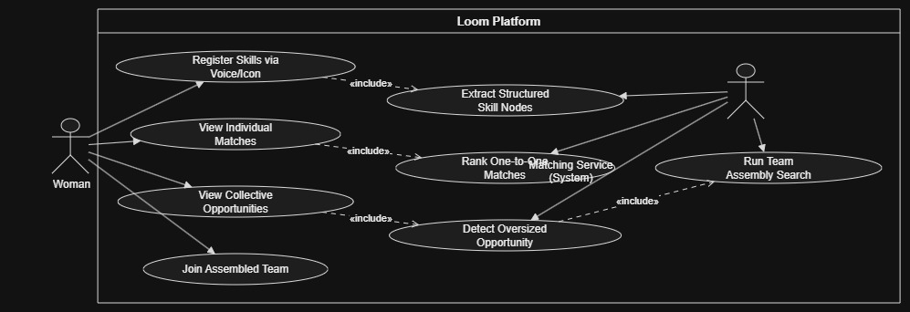{: .wide }

**Domain model**

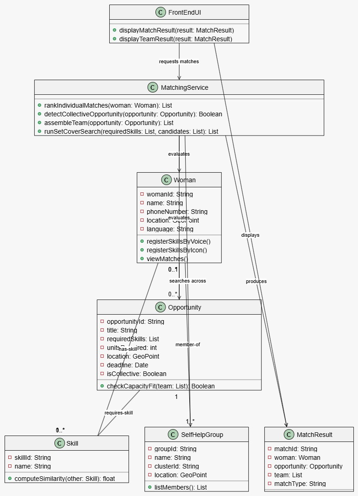{: .wide }

**Interaction — three scenarios**

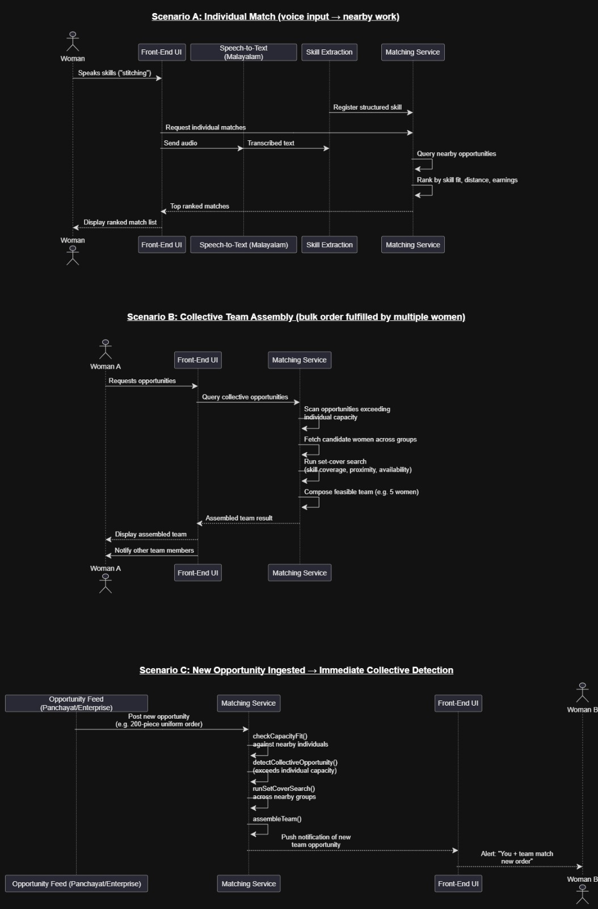{: .wide }

**Where the build diverges from these diagrams**

| In the design | In the deployed system | Why |
|---|---|---|
| `Speech-to-Text (Malayalam)` in Scenario A | Not built. Skill entry is typed; speech works for *output* only | The adapter shape exists (`src/lib/speech.ts`); the input half is §11's top priority |
| `Register Skills via Voice/Icon` | Typed entry. The icon path was built, then dropped — migration `002` removes `skills.icon_key` | Icons could not carry a growing, user-created vocabulary |
| `Skill.computeSimilarity(other): float` | Built, then deliberately demoted. Similarity now decides only whether a word is a *typo*; meaning comes from a curated alias table | It resolved "covering" to *cooking*. §7.4 |
| `Opportunity Feed (Panchayat/Enterprise)` ingesting orders, Scenario C | Not built. Orders are posted by customers in the app | Feed ingestion is future scope; the collective detection it triggers is built and works |
| `Push notification of new team opportunity` | The app polls every 7 seconds | Push needed a browser-side database client, which is what made chat world-readable. §7.6 |
| A single actor, `Woman` | Two roles: **provider** and **customer**, one phone number able to hold both | The design had nobody posting the work. A marketplace needs the other side, and giving the customer the decision (§6.5) is what keeps a provider from being assigned work she never agreed to |
| `Woman`, `SelfHelpGroup` | `providers`, `groups`, plus `cds` for the federation above a group | Same shape, renamed for a schema that also holds customers |

The matching core survived intact: `rankIndividualMatches`, `detectCollectiveOpportunity`,
`assembleTeam` and `runSetCoverSearch` are the four operations on `MatchingService` in the class
diagram, and all four exist — as `matching/feed`, the `mode: "group"` branch of `requests/create`,
`team-assembly/assemble`, and the covering loop inside it (§6.3).

---

## 6 · Key components built — with code

### 6.1 Skill canonicalisation — the thing the marketplace depends on

`api/_routes/skills/resolve.ts` resolves typed free text to one canonical skill in four tiers:
**exact → curated alias → typo → new skill (translated and created).**

```
"sewing"            → തയ്യൽ  (stitching)   matched via alias
"garment finishing" → തയ്യൽ  (stitching)   matched via alias
"thayyal"           → തയ്യൽ  (stitching)   matched via alias   (Manglish)
"stiching"          → തയ്യൽ  (stitching)   matched via typo
"covering"          → covering                new skill, created
```

The subtle part: **meaning lives in the curated alias table (109 phrases over six skills, in
English, Malayalam and Manglish); fuzzy matching is demoted to absorbing typos only.**

```ts
// api/_lib/text.ts
//
// Is `input` a MISSPELLING of `candidate` — not "does it mean something similar".
//
// Character similarity cannot express meaning, and treating it as if it could produced real
// nonsense: "covering" scored 0.56 on trigrams against the alias "catering" and was filed
// under cooking. Two words differing by two letters are not related, they merely look alike.
//
// Meaning lives in the curated alias table instead, which is why "garment finishing" resolves
// to stitching despite sharing almost no characters with it.
export function isProbableTypo(input: string, candidate: string): boolean {
  const a = normalize(input);
  const b = normalize(candidate);
  if (a === b) return true;
  // Too short to correct safely — at four characters one edit is a quarter of the word, and
  // "cook", "book" and "look" are all a single edit apart.
  if (a.length < 5 || b.length < 5) return false;
  if (similarity(a, b) < TYPO_TRIGRAM_MIN) return false;              // 0.70 trigram overlap
  return editDistance(a, b) / Math.max(a.length, b.length) <= TYPO_EDIT_MAX;  // 0.15
}
```

Measured on real inputs, genuine typos land near **0.11** normalised edit distance
(`stiching`/`stitching`) while unrelated lookalikes sit at **0.25** (`covering`/`catering`) — the
two separate cleanly, which is why both tests must pass.

### 6.2 Deterministic individual matching

```ts
// api/_lib/scoring.ts — weights are fixed config; same inputs → same score → same ranking.
export const WEIGHTS = { skill: 0.5, dist: 0.3, earn: 0.2 } as const;

export const proximity      = (km: number) => (isFinite(km) ? 1 / (1 + km) : 0);
export const normalizedPay  = (pay?: number) => (!pay || pay <= 0 ? 0 : Math.min(1, pay / 2000));
export const skillFit       = (prof: number) => Math.max(0, Math.min(1, prof / 5));

export function score(fit: number, distanceKm: number, pay: number | undefined) {
  const total =
    WEIGHTS.skill * fit + WEIGHTS.dist * proximity(distanceKm) + WEIGHTS.earn * normalizedPay(pay);
  return { skillFit: fit, proximity: proximity(distanceKm), pay: normalizedPay(pay), total };
}
```

Distance is a haversine computation over stored coordinates. No model, no inference cost, no
training data required — and every ranking is reproducible and auditable, which we consider a
requirement for a system that intermediates people's income.

### 6.3 Collective matching — the headline capability

`api/_routes/team-assembly/assemble.ts` runs a **greedy, capacity-aware set-cover** over the
cluster, and reports honestly whether coverage is complete.

```ts
// Deterministic: candidates sorted by (proficiency desc, distance asc, seq asc) — no
// randomness, so the same request always yields the same team.
while (progress) {
  progress = false;
  for (const rs of skills) {
    const need = remaining.get(rs.skill_id) ?? 0;
    if (need <= 0) continue;
    const eligible = [...candMap.values()].filter(c => c.capLeft > 0 && c.prof.has(rs.skill_id));
    if (eligible.length === 0) continue;
    eligible.sort((a, b) => {
      const pa = a.prof.get(rs.skill_id)!, pb = b.prof.get(rs.skill_id)!;
      if (pb !== pa) return pb - pa;                       // 1. proficiency
      if (a.distance !== b.distance) return a.distance - b.distance;  // 2. proximity
      return a.provider.seq - b.provider.seq;              // 3. explicit tiebreak
    });
    const pick = eligible[0];
    const take = Math.min(need, pick.capLeft);             // capacity-aware
    pick.capLeft -= take;
    remaining.set(rs.skill_id, need - take);
    /* … record the assignment … */
    progress = true;
  }
}
const complete = [...remaining.values()].every(x => x <= 0);  // reported, never faked
```

That third sort key is not cosmetic. Convex `_id`s are creation-ordered; Postgres UUIDv4 is
random. On migration, ties silently reordered between identical runs and determinism broke —
fixed with explicit `seq bigserial` tiebreak columns on `providers` and `team_members` (§6.1
of the challenges below).

**Verified on the deployed instance, over seeded data:** a 30-unit, three-skill uniform order
assembles **18 provider records across 6 seeded groups**, coverage complete, with 18 audit rows
written to `matches`. Seeded records, not real women — see the note at the top.

### 6.4 Authentication — phone + OTP, no passwords

The server resolves the account from the verified number and returns one of three outcomes:

| Outcome | Meaning |
|---|---|
| `session` | Exactly one account → straight to the dashboard |
| `choose` | The number holds both a provider *and* a customer account → pick one |
| `signup` | New number → collect name and role |

For the latter two, the server issues a **short-lived HMAC-signed ticket** proving the number
passed OTP, redeemed exactly once by `complete-login`. No name or role is asked before
verification — a deliberate low-friction path for a first-time, low-literacy user.

### 6.5 Customer control

The customer is never presented with a fait accompli:

- Providers who apply to an individual job are **applicants**, not winners — the customer chooses,
  and everyone else is declined automatically.
- Any team member can be **replaced before confirmation**, from a ranked list of alternatives that
  excludes people already on the team.
- After confirmation, swapping an *accepted* member is refused (it would revoke work she agreed
  to) but replacing a member who *declined* is allowed — her slot is already vacant.
- Confirming a team creates a **team chat**, idempotently, whose membership resolves from the team
  itself, so it follows accepts, declines and replacements with no bookkeeping.

---

## 7 · Challenges faced, and how we solved them

### 7.1 Migrating the entire backend off Convex, mid-project

The first working build ran on Convex. Moving to Supabase + Vercel meant rewriting every backend
function *and* reproducing Convex's implicit guarantees. The subtlest: **Convex `_id`s are
creation-ordered, Postgres UUIDv4 is random.** Deterministic ranking broke silently on ties — the
same request could return a different team on two consecutive runs, with nothing in any log.

**Solved** with explicit `seq bigserial` tiebreak columns, sorted on last in every ranking path.

### 7.2 Three deployment faults that each reported success

The hardest debugging of the month. Every one produced a **green build and a ● Ready
deployment** while being completely broken.

1. **A build that produced nothing.** Production served an empty page:
   ```
   Build Completed in /vercel/output [92ms]
   Skipping cache upload because no files were prepared
   ```
   92 ms, no `npm install`, no functions. The project was building from the repository root,
   which has no `package.json`. Root Directory had since been corrected — but *settings do not
   retroactively rebuild*, so the broken deployment stayed live.

2. **The Hobby function cap.** Vercel creates one function per file under `api/`, capped at 12;
   we had 32 routes. The build succeeds and the **deploy step** fails afterwards, which reads
   like a code fault. **Solved** by moving handlers into `api/_routes/` — underscore directories
   are excluded from function detection — behind a single entry point.

3. **A catch-all that is built but never routed to.** The obvious fix, `api/[...path].ts`,
   appears in the build output as `λ api/[...path]` and then receives nothing: every request
   returns Vercel's own `NOT_FOUND`, with no invocation and no logs. **Isolated** by deploying a
   static `api/ping.ts` beside it, which answered 200 from the same deployment — proving `/api`
   routing worked and catch-all routing specifically did not. **Solved** with a static
   `api/router.ts` plus an explicit rewrite, preserving every public URL.

4. **ESM imports that resolve at compile time but not at runtime.** `@vercel/node` does not
   bundle; it compiles and runs under Node's native ESM loader, which requires fully specified
   paths:
   ```
   ERR_UNSUPPORTED_DIR_IMPORT: Directory import '/var/task/app/api/_routes'
   is not supported resolving ES modules imported from .../api/router.js
   ```
   The `TS2835` build warnings had been flagging this the whole time and were dismissed as
   cosmetic, because the build still completed. **Fixed across 145 imports in 37 files.**

> **Lesson we learnt:** a green deployment proves the build ran, not
> that the thing works. One real request against the deployed URL is what closes the loop. This is
> why we later wrote `docs/DEMO_RUNBOOK.md` and ran it against production (§9).

### 7.3 The SPA rewrite swallowing the entire API

`vercel.json` rewrote `/(.*)` → `/index.html`. Harmless while each route was its own file (exact
filesystem matches are checked before rewrites) — but once the API became one dynamic route, the
rewrite won, and every `/api/*` call returned the app shell instead of JSON. The symptom was an
HTML-parse error in the client and a perfectly healthy-looking deployment. Now written
`/((?!api/).*)`.

### 7.4 Skills fragmenting, then a matcher that invented meaning

Without canonicalisation, "sewing", "tailoring" and "തയ്യൽ" become three unrelated skills and
search silently misses providers. We added fuzzy character matching — and then found it had
resolved **"covering" to cooking**, having scored 0.56 Sørensen–Dice against the alias
"catering". Two words differing by two letters are not related; they merely look alike. Worse, it
*missed* real relationships like "garment finishing" → stitching, which shares almost no
characters.

**Solved** by separating the two jobs entirely (§6.1): meaning moved into a curated alias table
grown from 25 to **109 entries** across the three registers people actually type in Kerala, and
fuzzy matching was demoted to typo absorption with two independent thresholds.

### 7.5 An unusable main screen

The app was slow enough to be unusable on the screen customers land on. The cause was not the
network: the API resolved relations in JavaScript `for` loops rather than SQL joins, so latency
scaled with row count — the directory search issued roughly **two queries per provider**.

Measured against production, before and after:

| Endpoint | Before | After | Change |
|---|---|---|---|
| `providers/search` (Browse — the landing screen) | 21,008 ms | 1,350 ms | **15.6× faster** |
| `chat/threads` | 2,315 ms | 952 ms | 2.4× faster |

Two changes. **First**, the hot paths were batched to a fixed number of queries regardless of
result size — `hydrateCards` for provider cards, one query for every thread's last message,
`distanceMap` in place of a per-row distance lookup, and PostgREST embedded joins for the team
routes. **Second**, the function was moved from `iad1` to `bom1`: requests were entering at the
Mumbai edge and executing in Washington, adding a round trip on every leg.


### 7.6 Chat readable by anyone — four independent ways

A security review of the chat feature found conversations were exposed four separate ways. All
four are fixed:

| # | Issue | Fix |
|---|---|---|
| 1 | `chat_threads` and `messages` had `for select using (true)` RLS, so the anon key — which ships in the public JS bundle — could read **every message in the app** via PostgREST | Policies dropped; no Supabase client ships to the browser at all |
| 2 | `GET /api/chat/threads` returned the 50 most recent threads **system-wide** to any signed-in user, each with its last message | Scoped to threads the caller participates in |
| 3 | `GET /api/chat/messages` served any thread to anyone holding its id | Participation checked; non-participants get **404, not 403**, so a thread id cannot be confirmed by probing |
| 4 | Provider chats were keyed on the provider id alone, so every customer contacting the same provider shared one thread and read the others' messages | Keyed on both parties |

The root cause of #1 is worth recording. The permissive policy existed so a browser-side Supabase
client could receive Realtime updates. **RLS cannot express "only participants" here** — the app
does not use Supabase Auth, so to Postgres every browser caller is the same anonymous role, with
no identity to filter on. The fix was to stop the browser talking to the database entirely and
move the check into the API, which knows the user via the `sessions` table.

Chat now polls every 7 seconds instead of subscribing — a deliberate, stated cost. Removing
`@supabase/supabase-js` from the browser also **halved the bundle, 438 KB → 221 KB**, which
matters on the connections our users have.

Migration `005_enable_rls_everywhere.sql` subsequently enabled RLS on **all 24 tables**, not just
the chat ones.

### 7.7 Database writes

Nobody could sign in. `request-otp` still wrote a `role` column that migration `001` had dropped,
so the insert failed with `PGRST204` — but that upsert was the one Supabase call in the file whose
result was never checked. The handler carried on and returned a freshly generated code **that had
never been stored**. The user saw an OTP on screen, and `verify-otp` then correctly told them to
request one.

Auditing for the same pattern found five more, each turning a failure into a plausible-looking
success:

```
providers/update-profile   a profile save that appears to work and does not
auth/sign-out              leaves a live session while reporting sign-out
auth/verify-otp            a code that cannot be consumed can be replayed
chat/threads, chat/create  rollback deletes leaving orphan threads
```

All six now surface the error. **Pattern learned: an unchecked write is a bug that reports
success** — the same class as §7.2's green deployments.

### 7.8 A conversation named after the wrong person

Found by walking the app during screenshot capture. A provider opening Communities saw her own
name at the top of every conversation, where the other person's should be.

A thread's title is written **once**, at creation, by whoever opened it. A customer starts a
chat from a provider's profile, so the title stored is the provider's name — correct for the
customer reading it, and wrong for the provider, who is then looking at a list of conversations
all labelled with herself. There is no title that is right for both ends of a two-person
conversation, because the useful label is *the other person*, and who that is depends on who is
reading.

So it is no longer stored. `chat/threads` now resolves the counterparty per viewer — the
provider's name for a customer, the customer's name for a provider — batched into one query per
side rather than one per thread, because this list polls every seven seconds. Group and team
threads keep their stored titles: a conversation the customer deliberately named "Onam bulk
order" means the same thing to everyone in it.

The chat screen itself was headed only `ചാറ്റ്`, so having opened a conversation you could no
longer tell which one it was. It now carries the same resolved name.

## 8 · User interface

Captured against the live deployment, on a phone.

Several screens show rows named `probe`, `probe2` and `DB connectivity probe`. Those are not
product content: they are requests created by the automated end-to-end suite of §9.1 and by
manual checks against the deployed database, left in place because these captures are of the
real running system rather than a staged one. They are visible here for the same reason the
seeded data is — nothing in this report is a mock-up.

### 8.1 Sign-in and first-time onboarding

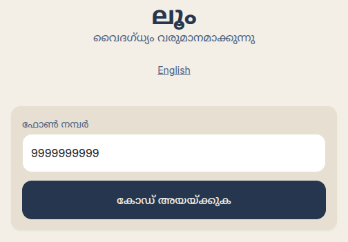

**The app opens in Malayalam.** `ലൂം · വൈദഗ്ധ്യം വരുമാനമാക്കുന്നു` — a first-time user is never
shown English unless she asks for it, and the choice she makes persists across reloads. Sign-in
is **phone + OTP only**: no password, and no name or role asked before the number is verified.

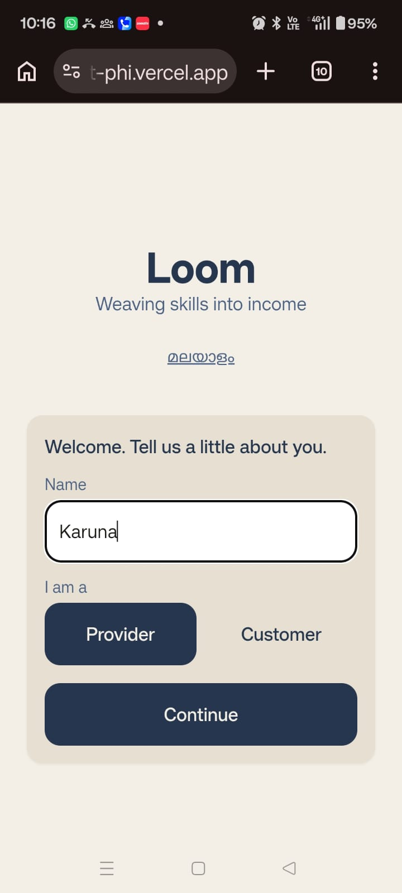

Only after verification does the app ask who you are. One number, one decision: provider or
customer.

### 8.2 Skill canonicalisation — the claim, made visible

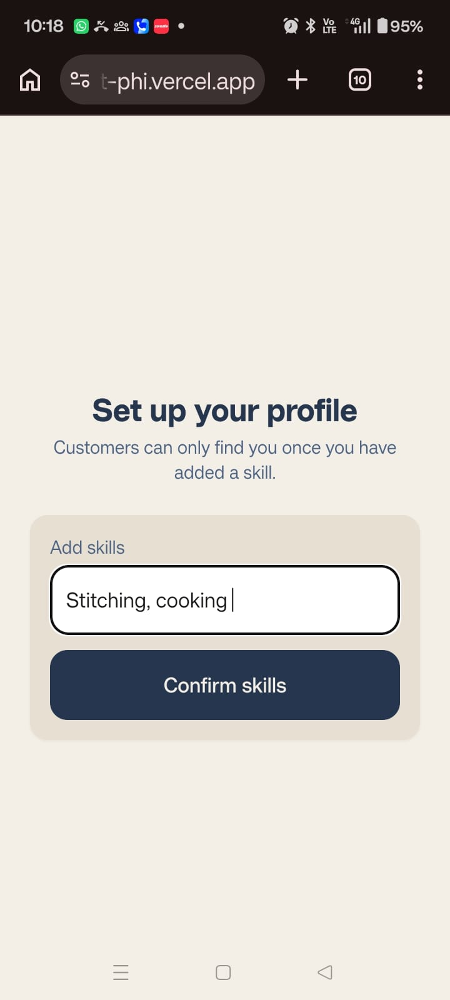

A provider types her skills as free text — whatever words she actually uses, in whichever of the
three registers she types in.

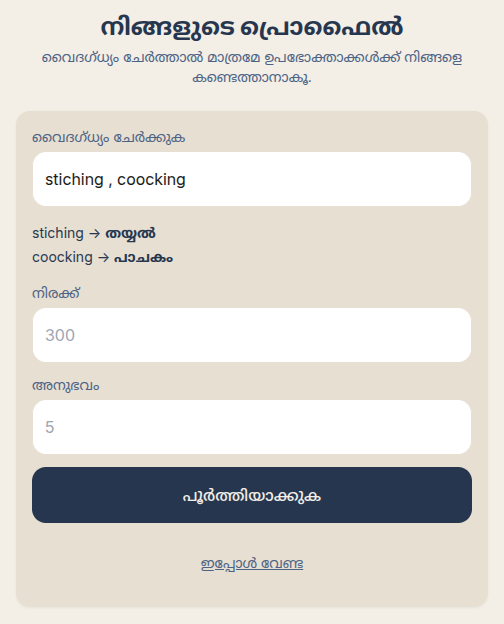

**This screen is the canonicalisation claim, visible.** She typed `stiching` and `coocking` —
both misspelled — and the app reads back `stiching → തയ്യൽ` and `coocking → പാചകം` *before* she
commits. Two things are happening at once: the typo tier of §6.1 absorbs the misspelling, and
the canonical skill is shown to her in Malayalam, which is the same node a customer filtering
for stitching will search. Nothing fragments into an unsearchable synonym, and she can see that
it did not before she taps `പൂർത്തിയാക്കുക`.

### 8.3 Provider — ranked work, in Malayalam

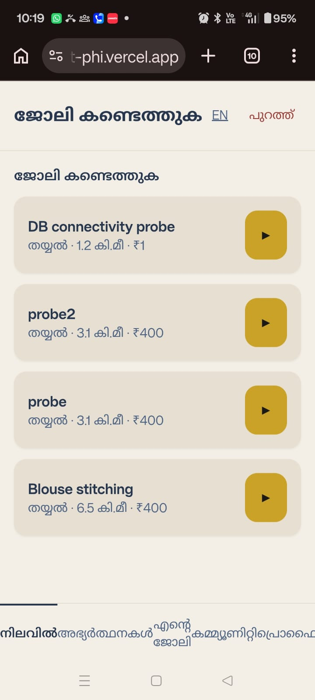

`ജോലി കണ്ടെത്തുക` — matches ranked by the deterministic score of §6.2, each showing the matched
skill, distance and pay. The ▶ control speaks the match explanation aloud.

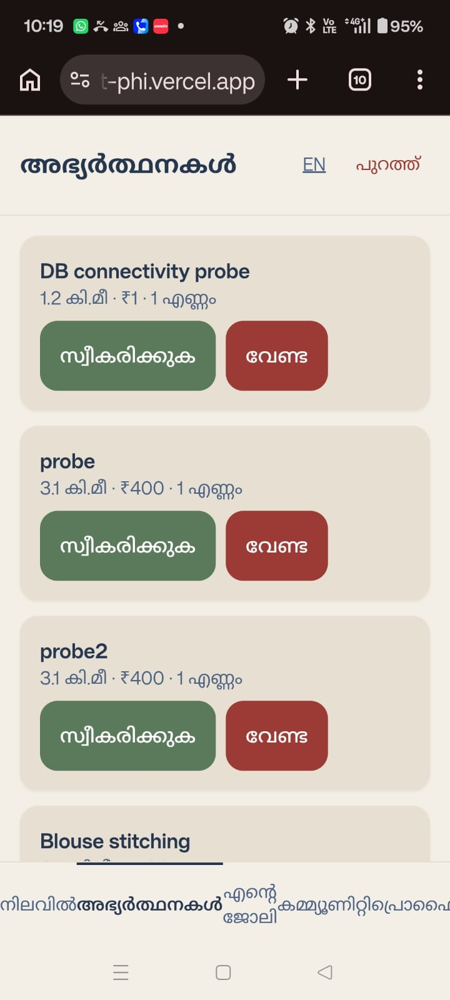
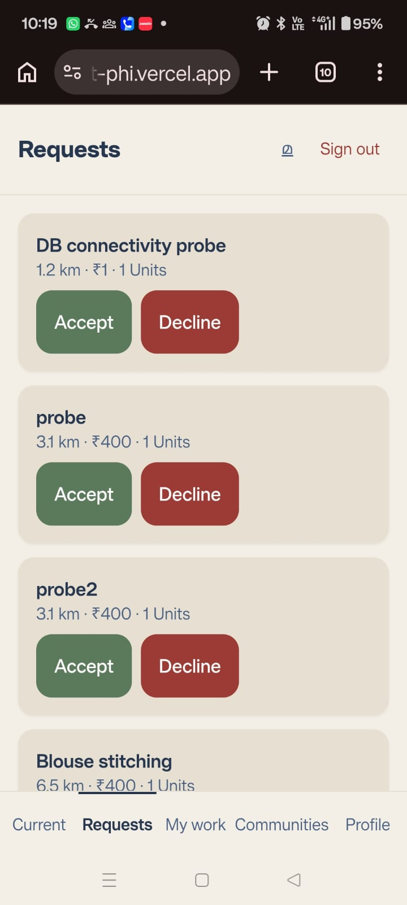

The same screen in both languages. Accept and decline are `സ്വീകരിക്കുക` and `വേണ്ട` — the
interface is translated, not merely transliterated, and the skill names come from the canonical
vocabulary rather than a UI string table.

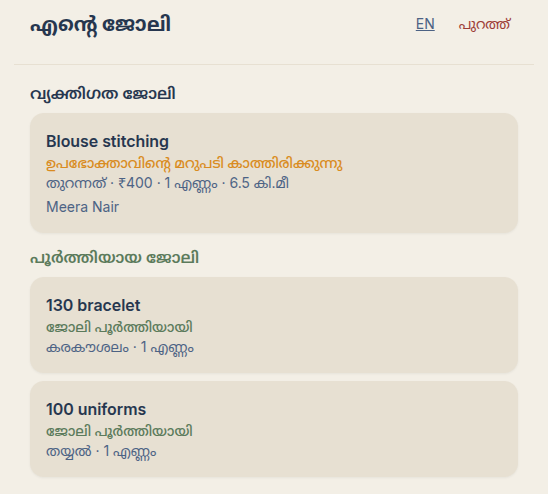

`എന്റെ ജോലി` answers the question a provider actually has: *what happened to the work I said yes
to?* Two details here were defects we fixed, and both are the kind that look like nothing:

- The blouse job is marked `ഉപഭോക്താവിന്റെ മറുപടി കാത്തിരിക്കുന്നു` — **waiting for the
  customer's reply**. Applying registers interest; it does not win the job. Before this screen
  existed an accepted job simply vanished from every provider view, and the state it vanished
  into was one the provider had no way to learn.
- Finished work sits in its own `പൂർത്തിയായ ജോലി` section. Until the most recent commit a
  provider was never told a job had ended — the card kept reporting the *team's* status, which
  stays `confirmed` forever, so a completed job showed as active indefinitely.

### 8.4 Customer — browse, filter, request

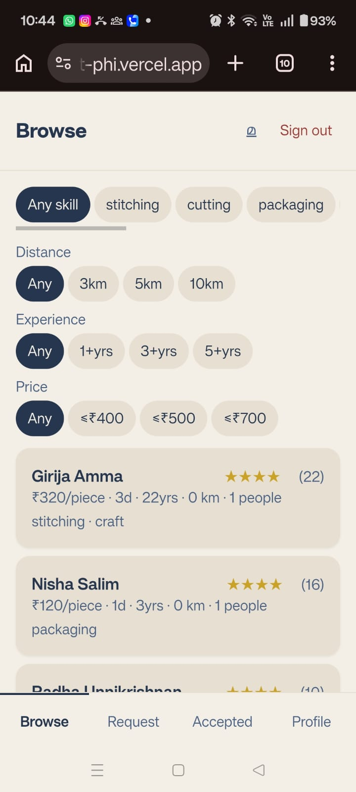

Skill, distance, experience and price filters over available providers only, each card showing
rate, delivery time, experience, distance, capacity and rating.

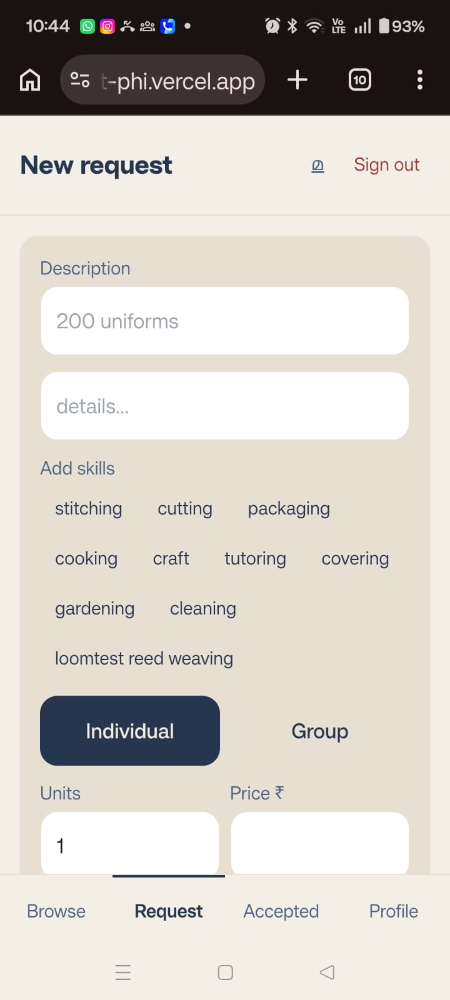

Posting work: pick skills from the canonical vocabulary, then choose **Individual** or **Group**.
That single toggle is what routes an order into team assembly.

### 8.5 Collective matching — the capability nothing else here has

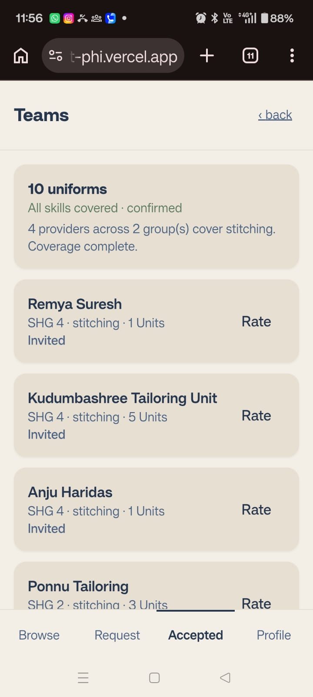

**This is the screen the whole project exists for.** A ten-unit uniform order that no single
provider could take has been assembled into a team, and the app states its own reasoning:

> All skills covered · confirmed
> **4 providers across 2 group(s) cover stitching. Coverage complete.**

Read the members. `Kudumbashree Tailoring Unit` takes 5 units, `Ponnu Tailoring` 3, and
`Remya Suresh` and `Anju Haridas` 1 each — **capacity-aware**, so nobody is assigned work she
cannot deliver, and the units sum to the order. They sit in **two different seeded groups**,
`SHG 4` and `SHG 2`, which is the behaviour that matters: the engine composes across groups
rather than within one, which is what no single-listing job board can represent and what a human
coordinator cannot do across clusters she does not know.

*These providers are seeded demo records with invented names, not real women — see the note at
the top of this report. What this screen demonstrates is that the algorithm works, not that
anyone has used it.*

Every member reads `Invited`. The customer confirmed the team, and each provider now decides for
herself — the invitation is an offer, not an assignment, and until she accepts, nothing is
committed on her behalf. The same order assembled twice produces this same team, in this same
order, because the ranking is deterministic down to an explicit tiebreak column (§6.3).

### 8.6 Communities — conversations private to their participants

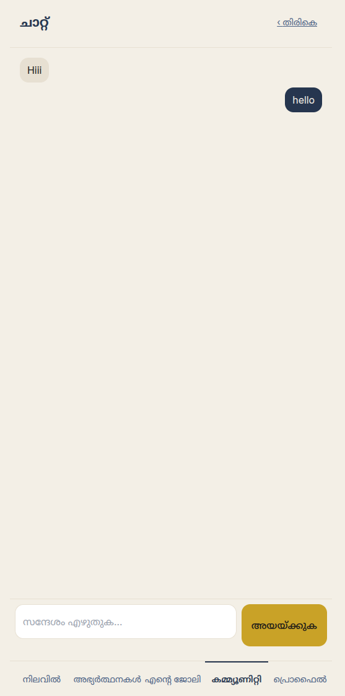

`ചാറ്റ്` — a one-to-one conversation. Sent messages sit right, received left, and each received
message carries a listen control, because the person who cannot read the message is exactly the
person who needs it spoken. The composer sits **above** the tab bar: it used to render
underneath it, at the same `bottom-0`, which left the message box unreachable on the screen
whose entire purpose is sending messages.

A thread is visible only to the people in it. There is no participants table — membership is
derived from the thread's context (§7.6) — so a customer, a provider on a team, and an outsider
each get a different answer to the same URL, and the outsider gets `404` rather than `403`.

### 8.7 Still to capture

| # | Screen | What it must show | Runbook step |
|---|---|---|---|
| 12 | Provider invitation after confirm | The same `എന്റെ ജോലി` screen as §8.3, now carrying the team invitation from §8.5 — the pair proves nothing reaches a provider before the customer confirms | C4 then C8 |
| 14 | Communities thread list | Each conversation named after **the other person in it**. Held back deliberately: the deployed build still labels a thread with the viewer's own name, and the fix in §7.8 is committed but not yet released | D1 |

---

## 9 · Testing and verification

Two layers: an automated end-to-end suite that drives the deployed API, and a manual runbook
that drives the screens.

### 9.1 Automated end-to-end suite — 78 checks, 0 failures

`app/scripts/e2e.mjs` (`npm run test:e2e`) signs **three provider accounts and two customer
accounts** in through the real phone + OTP flow and drives the complete product against
production — no fixtures, no mocks, no direct database access. Three providers and two
customers are the minimum that can express the interesting cases: two providers competing for
one job, a customer choosing between them, a team whose members accept and decline
independently, and a non-participant who must be locked out of a conversation.

**Run of 15 August 2026 against production: 78 passed, 0 failed.**

| Section | Checks | What it proves |
|---|---|---|
| A · Authentication | 6 | Signup, returning sign-in, `auth/me`, wrong OTP rejected, bogus token yields no session |
| B · Skill canonicalisation | 7 | `sewing`→`തയ്യൽ` and `catering`→`പാചകം` by alias; `stiching`→stitching by **typo**; `garment finishing`→stitching despite sharing almost no characters; a new phrase becomes its own skill and is reused, not duplicated; **`covering` no longer collapses into cooking** |
| C · Profiles | 5 | Provider and customer profile writes persist and read back |
| D · Browse and filters | 5 | 43 cards; skill filter 23/43; price filter 39 ≤ ₹400; distance filter 27 ≤ 5 km; combined 16 |
| E · Individual lifecycle | 17 | Post → ranked feed → **Malayalam narration with score breakdown** → two providers apply → customer chooses → **loser auto-declined** → second choice rejected 409 → edit-after-assign rejected 409 → complete → double-complete rejected 409 → rate → re-rate revises rather than duplicates → appears in history |
| F · Collective lifecycle | 19 | Group order stays **out** of the individual feed → team assembled, coverage complete → **units split 4 + 2 = 6 respecting capacity** → **determinism: re-assembly yields the identical team** → re-assembly replaces the draft, no orphans → **provider sees nothing before confirm**, and cannot accept even by calling the API directly (409) → swap before confirm → confirm → invitations appear → one accepts, one declines → **declined member replaced on a confirmed team** → **accepted member cannot be swapped out (409)** |
| G · Chat and privacy | 7 | Participant reads; **non-participant gets 404, not 403**; her thread list excludes it; re-opening reuses the thread; confirming a team creates the team chat |
| H · Authorisation | 7 | Request detail 401 without a session; no cross-customer edit (403); no assembling someone else's order (403); customer cannot read the provider feed; grievances scoped to their author |
| I · Teardown | 2 | Sign-out kills the token |

Selected output, verbatim:

```
✅ 'stiching' (typo) resolves to stitching via typo tier — → stitching via typo
✅ 'covering' does NOT collapse into cooking — covering → covering via exact
✅ the losing applicant is declined automatically — Test Provider Three state=declined
✅ units are split across members, respecting capacity — Three:4 + Two:2 = 6 units
✅ DETERMINISM — re-assembling the same request yields the identical team
✅ provider cannot accept before confirmation, even via direct API call — 409 This team is not confirmed yet
✅ a DECLINED member can be replaced on a confirmed team — her slot was already vacant
✅ an ACCEPTED member cannot be swapped out — 409 only a provider who declined can be replaced
✅ NON-participant gets 404, not 403 — status=404

  78 passed, 0 failed, 78 checks total
```

Two behaviours the suite pinned down that are worth stating, because both look like bugs and
are not: re-assembling a request **replaces** the previous draft rather than accumulating
teams, and request detail is readable by any signed-in user — the guard is the session, not
ownership, because a provider must read a request to decide whether to apply.

### 9.2 Manual runbook — 52 checks, 6/6 sections pass

`docs/DEMO_RUNBOOK.md` — 52 checks in six sections, each stated as **action → expect →
why it matters**, with the claim it demonstrates, so a failure tells us exactly which claim we can
no longer make. A full pass takes ~15 minutes.

**Result of the full pass against production, 8 August 2026:**

| Section | Result | Notes |
|---|---|---|
| A · Provider journey | ✅ Pass | **Found and fixed:** group orders were appearing in the individual work feed |
| B · Customer journey | ✅ Pass | Availability filter verified by ratio — 44 total, 4 unavailable, 40 returned |
| C · Collective journey | ✅ Pass | **18 seeded providers across 6 seeded groups**, coverage complete; invitation correctly withheld until confirm |
| D · Communities | ✅ Pass | Members read the thread, an outsider gets 404 and an empty list |
| E · Cross-cutting | ✅ Pass | **Found and fixed:** text controls at 20 px against the 56 px floor |
| F · Negative checks | ✅ Pass | 18 team audit rows written; swap-after-confirm returns 409; unauthenticated request detail now 401 |

Section F exists because **each of those failures is silent** — the app looks fine and the data is
wrong. It checks that the anon key returns `[]` against `sessions`, `providers` and `messages`;
that a request detail cannot be read without a token; that a thread id cannot be confirmed by
probing; that a request cannot be edited after assignment; that a provider cannot accept a team
invite before the customer confirms, even by replaying the API call directly; and that audit rows
are actually written.

**Test accounts** (live, sign in with the number; the OTP prints on screen):

| Role | Phone | Name |
|---|---|---|
| Provider | 9000000101 | Test Provider One |
| Provider | 9000000102 | Test Provider Two |
| Provider | 9000000103 | Test Provider Three |
| Customer | 9000000201 | Test Customer One |
| Customer | 9000000202 | Test Customer Two |

**Demo data seeded:** 40 provider records written to read like Ernakulam SHG listings — **invented
names**, plausible rates, capacity and Malayalam skills, so the screens do not look like
scaffolding. No row corresponds to a real person. 6 customers, 5 requests spanning `open` / `assembling` / `assigned` /
`completed`, 8 portfolio items, 9 bilingual ratings, and a seeded conversation.

---

## 10 · Milestones achieved — measurable

| Milestone | Measure |
|---|---|
| Working, publicly reachable deployment | Live at a URL anyone can open, no install |
| Collective matching proven end to end | 18 seeded providers across 6 seeded groups assembled for one 30-unit order |
| Determinism proven | Same request → same team, enforced by explicit tiebreak columns |
| Canonical vocabulary | 109 alias phrases over 6 skills in 3 registers; typo tier separated from meaning |
| Malayalam-first proven | App opens in Malayalam, persists the choice, self-hosted font loads |
| Landing screen made usable | 21,008 ms → 1,350 ms (**15.6×**) |
| Payload halved for low-bandwidth users | 438 KB → 221 KB |
| Chat privacy | 4 vulnerabilities closed; RLS on 24/24 tables |
| Silent-failure class eliminated | 6 unchecked writes fixed |
| Verification discipline | 78-check automated suite (0 failures) **and** a 52-check manual runbook, both against production |

---

## 11 · Known gaps — stated plainly

**The largest gap: no users.**

Nobody outside this team has used Loom. No self-help group has been onboarded, no Kudumbashree
unit has been approached, and no woman has listed a skill or been matched to work. Every result
in this report was produced by us, against seeded data, on a deployment nobody else has opened.

We are stating this at the top of the gap list rather than burying it, because it is the honest
shape of the month: we built and hardened a system, and we have not yet validated a single
assumption about the people it is for. A matching engine that is correct and unused has proved
its arithmetic and nothing about its premise. Everything below is a smaller gap than this one.

**Not yet implemented**

- **Speech-to-text.** Skill entry is typed. Spoken *output* works; spoken *input* does not, so the
  voice-first goal for low-literacy users is only half met. **This is our top priority.**
- **Learned embeddings.** Skill matching uses a curated alias table, not vector similarity. It is
  deterministic and explainable, but does not generalise to phrases nobody has listed.
- **Real locations.** A provider's location is assigned deterministically rather than captured, so
  distances are computed correctly over placeholder coordinates — "3.2 km" is correct arithmetic
  over data that does not mean anything yet.
- **Graph visualisation.** The justification for a match is text, not an animated traversal.
- **Admin surface.** Grievances are collected; there is no moderation screen.

**Operational caveats**

- **Auth is demo-grade.** Sessions are bearer tokens in `localStorage` against our own `sessions`
  table, not Supabase Auth. OTP is generated when Twilio is configured; without it the code is
  shown on screen — that is the demo path, not a bug.
- **New skills are not translated** unless `BHASHINI_API_KEY` is set; they fall back to the English
  word in the Malayalam field.
- **Chat polls at 7 seconds** rather than pushing live — the deliberate cost of closing the privacy
  hole in §7.6.
- **Anon key rotation pending.** The key was public while the permissive policies of §7.6 existed.
  Those policies are gone and verified gone, so nothing is exposed today; rotating the key is the
  remaining housekeeping.
- **Lint debt.** Some `no-misused-promises` warnings in `src/`; not in the deploy path.

**Next four weeks, in order**

0. **Put it in front of one real person.** One woman, one skill, one order — sat beside her while
   she uses it. Everything below assumes we are right about her, and we have not checked. This is
   ordered zeroth because no amount of the rest substitutes for it.
1. Capture real locations (browser geolocation + a panchayat-level fallback picker).
2. Speech-to-text for skill entry — the other half of voice-first.
3. Admin/moderation surface for grievances.
4. A graph view of the match justification.

---

## 12 · Evidence and links

| What | Where |
|---|---|
| **Live application** | https://loom-lovat-phi.vercel.app — sign in with any phone number; the OTP prints on screen in demo mode |
| **Repository** | https://github.com/nidheerakesh/loom |
| Full project submission document | `docs/SUBMISSION.md` |
| Product requirements | `docs/PRD.md` |
| Technical design | `docs/TDD.md` |
| User flows · UI/UX spec | `docs/USER_FLOWS.md` · `docs/UI_UX_DESIGN.md` |
| **Demo runbook + results** | `docs/DEMO_RUNBOOK.md` |
| **Automated end-to-end suite** | `app/scripts/e2e.mjs` — `npm run test:e2e` |
| Deployment constraints and their symptoms | `app/README.md` |
| Matching engine | `app/api/_lib/scoring.ts` · `app/api/_routes/team-assembly/assemble.ts` |
| Skill canonicalisation | `app/api/_routes/skills/resolve.ts` · `app/api/_lib/text.ts` |
| Schema and migrations | `app/supabase/schema.sql` · `app/supabase/migrations/` |

---

## 13 · Team contributions

| Member | Focus this month |
|---|---|
| **Nidhi Rakesh** | Backend architecture and Supabase/PostgreSQL integration; the database schema; deterministic individual matching and cross-SHG team assembly; the API routes; authentication; deployment and the debugging of it. Performance optimisation, and resolving the deployment faults during the Convex → Supabase migration. |
| **Niveditha G. S.** | The React/Vite frontend and the provider and customer screens; the Malayalam-first interface; skill entry and search flows; team selection and confirmation UI; the chat interface; accessibility work, responsive design, and integration against the backend APIs. |
| **Anjana Nandakumar** | Problem research and product requirements; user flows and UI/UX planning; Malayalam and localisation requirements; realistic demo scenarios and data; testing and validation through the production demo runbook, and the identification and verification of usability, accessibility and functional defects. |

---

## 14 · In one line

India has built the world's largest network of women's self-help groups and given them credit.
What is missing is the intelligence to route income through that network.

Loom is an attempt at that layer. This month it went from a planning document to a deployed,
secured, measured system: 42 routes, 24 tables, a deterministic matching engine, 78 automated
checks passing against the live deployment, and a landing screen taken from 21 seconds to 1.35.
Given a large order, it composes a capable team across groups and explains the result in
Malayalam — **on seeded data, in our own database.**

That is the whole claim, and it stops there deliberately. No self-help group has used this. What
the month proves is that the hard part is solvable and solved; what it does not prove is that we
understood the woman it is for. The next thing this needs is not more code. It is one real woman,
in one real group, with one real order.
